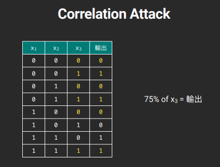
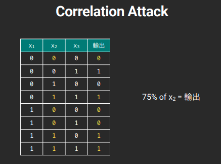

# Hw01

## COR (Correlation Attack)

### What is COR?
If we use Mixed LFSR to generate bits, and the operation of bits likes this:<br>
```python
class MyLFSR:
    ...
    def getbit(self):
        x1 = self.LFSR1.getbit()
        x2 = self.LFSR2.getbit()
        x3 = self.LFSR3.getbit()

        return (x1 & x2) ^ ((not x1) & x3)
    ...
```
The result of Mixed LFSR will be predictable because x2 and x3 have high degrees of similarity with result.<br><br>
For example: (Images are referred from the handout of TA oalieno)<br>


<br><br>
By calculation, the probability of degree of similarity between **x2 and output** is about **75%**, and it is about **75%** same when between **x3 and output**.

### Attack
Following is my payload:<br>
```python
#!/usr/bin/env python3
from functools import reduce
import json
import string

class LFSR:
    def __init__(self, init, feedback):
        self.state = init
        self.feedback = feedback
    def getbit(self):
        nextbit = reduce(lambda x, y: x ^ y, [i & j for i, j in zip(self.state, self.feedback)])
        self.state = self.state[1:] + [nextbit]
        return nextbit

class MYLFSR:
    def __init__(self, inits):
        inits = [[int(i) for i in f"{int.from_bytes(init, 'big'):016b}"] for init in inits]
        self.l1 = LFSR(inits[0], [int(i) for i in f'{39989:016b}'])
        self.l2 = LFSR(inits[1], [int(i) for i in f'{40111:016b}'])
        self.l3 = LFSR(inits[2], [int(i) for i in f'{52453:016b}'])
    def getbit(self):
        x1 = self.l1.getbit()
        x2 = self.l2.getbit()
        x3 = self.l3.getbit()
        return (x1 & x2) ^ ((not x1) & x3)
    def getbyte(self):
        b = 0
        for i in range(8):
            b = (b << 1) + self.getbit()
        return bytes([b])

def bytes_to_bits(a):
    return [[int(i) for i in f"{int.from_bytes(init, 'big'):016b}"] for init in [a]]

def corr(a: list, b: list):
    assert len(a) == len(b)
    s = 0
    for i,j in zip(a,b):
        if i == j:
            s += 1
    return s/len(a)

l1_fb = [int(i) for i in f'{39989:016b}']
l2_fb = [int(i) for i in f'{40111:016b}']
l3_fb = [int(i) for i in f'{52453:016b}']

mx = 0
qq = string.printable.encode('utf-8')
FLAG = b''
# l3_fb
for i in qq:
    for j in qq:
        l = LFSR(bytes_to_bits(bytes([i]+[j]))[0], l3_fb)
        guess = [l.getbit() for _ in range(100)]
   
        tmp = corr(output, guess)
        if mx < tmp:
            print(f"score: {tmp}, val: {i}, {j}, payload: \"{bytes([i]+[j])}\"")
            mx = tmp
            ans = bytes([i] + [j])
FLAG = ans + FLAG
print(FLAG)

mx = 0
# l2_fb
for i in qq:
    for j in qq:
        l = LFSR(bytes_to_bits(bytes([i]+[j]))[0], l2_fb)
        guess = [l.getbit() for _ in range(100)]
   
        tmp = corr(output, guess)
        if mx < tmp:
            print(f"score: {tmp}, val: {i}, {j}, payload: \"{bytes([i]+[j])}\"")
            mx = tmp
            ans = bytes([i] + [j])
FLAG = ans + FLAG
print(FLAG)

mx = 0
FLAG = b'  ' + FLAG
# l1_fb
for i in qq:
    for j in qq:
        l = MYLFSR([bytes([i]+[j]), FLAG[2:4], FLAG[4:6]])
        guess = [l.getbit() for _ in range(100)]
   
        tmp = corr(output, guess)
        if mx < tmp:
            print(f"score: {tmp}, val: {i}, {j}, payload: \"{bytes([i]+[j])}\"")
            mx = tmp
            ans = bytes([i] + [j])
FLAG = ans + FLAG.re
```
<br><br>
Because the feedbacks of l1, l2 and l3 are known, we can easily generate x1, x2 and x3 by given any two bytes as initial value.<br>
So we can only use 256\*256 times (2 bytes) to brute force the flag, and because flag is printable and not be `\n`, `\t`, `<space>`, `\r` and `\b`, we can reduce the range of character to 95, using 95\*95 times to brute force each block.<br><br>

#### For flag[4:6]
When there is 2 bytes making the probability of degree of similarity between x3 and `output.txt` be larger than other 2 bytes (closing 75%), the 2 bytes propably are part of flag.

#### For flag[2:4]
Same as  `flag[4:6]`.

#### For flag[0:2]
Once we get `flag[2:6]`, all we need to do is brute force 2 bytes, trying to make the probability of degree of similarity between output of **our `MYLFSR` is 100% same as `output.txt`**, then we will get the all flag.

<br><br><br>

## POA (Padding Oracle Attack)
Normally, if plaintext isn't multiple of 16, server will automatically pad it for us.<br>
The padding is usually with `bytes( [n] )*( n = (16 - len(plaintext)%16) )`, but sometimes it will define by user. Like this time, the padding is `bytes( [1] ) + bytes( [0] )*( n = (16 - len(plaintext)%16 - 1) )`.<br><br>

As we know, the server will print YES if encryption is successfully decrypted, and when:<br>
1. Padding is correct
2. Ciphertext is complete and loseless

, encryption will be successfully decrypted.<br>
We can build a payload which can pass server's padding rule, and **xor with byte** we build to **get decrypt**, then **xor with origin byte** to **get plaintext**.<br><br>
Pseudo code:<br>
```python
for value in range(0, 256): # bytes range
    if pass_padding_rule( origin_cipher[:position_to_brute_force-1] + value + rest_padding ):
        decrypt = 0x80 xor value # when the corresponding part of plaintext is 0x80, rule will be passed
        plaintext = origin_cipher[position_to_brute_force] xor decrypt # decrypt xor with origin byte, and the result is origin plaintext
```
P.S. Split cipher to blocks which size is 16 and use `n-1`th block to POA `n`th block

### Attack
Following is my payload:<br>
```python
#!/usr/bin/env python3
import os
from Crypto.Cipher import AES
from pwn import *

key = os.urandom(16)
"""
with open('flag', 'rb') as f:
    flag = f.read()
"""
flag = b'CTF{XXXXXXXX}'

class PaddingError(Exception):
    pass

def pad(data):
    padlen = 16 - len(data) % 16
    # 補上 1 + (padlen*8-1) 的 0, 並轉成二進位, 即為 2^(len*8)
    # padlen = 1 ==> 2^7,   1000 0000
    # padlen = 2 ==> 2^15,  1000 0000 0000 0000
    return data + int('1' + '0' * (padlen * 8 - 1), 2).to_bytes(padlen, 'big')

def unpad(data):
    for i in range(len(data) - 1, len(data) - 1 - 16, -1):
        if data[i] == 0x80:
            return data[:i]
        elif data[i] != 0x00:
            raise PaddingError
    raise PaddingError


def xor(a, b):
    return bytes([i^j for i,j in zip(a,b)])

r = remote('140.112.31.97', 30000)
r.recvuntil('cipher = ')
enc = bytes.fromhex(r.recvline().replace(b'\n', b'').decode('utf-8'))
assert len(enc) == 48

def oracle(text):
    r.sendline(text.hex())
    c = r.recvline()
    if b'YES' in c:
        return True
    else:
        return False

flag = b''
for i in range(16, len(enc), 16):
    if i == 32:
        ans = b'\x00\x00\x00\x00\x00\x00\x00\x00' # 第二輪
    else:
        ans = b''
    iv = enc[i-16:i] # e.g. 71e32b962e8eafdd62a9c55a4af44ce5
    block = enc[i:i+16] # e.g 0eb793e55975dca193e8ca93853bb21c
    print(iv.hex(), block.hex()) 
    for j in range(len(ans),16): # 長度為 16 的 ciphertext
        for k in range(256): # 00 ~ ff
            if bytes([k]) == iv[-j]:
                continue
            payload = iv[:15-j] + bytes([k]) # origin[-j] + 替換的
            # e.g. 71e32b962e8eafdd62a9c55a4af44c 00 for j = 0
            payload += xor(xor(ans, iv[-j:]), bytes( [0]*j )) # 讓後面的幾位數與 block xor 為 00
            # xor(ans, iv[-j:]) 會得到密文 (decrypt)
            payload += block
            if oracle(payload):
                ans = bytes([k ^ 0x80 ^ iv[15-j]]) + ans
                print(ans)
                break
    flag += ans

print(flag)
            
"""
71e32b962e8eafdd62a9c55a4af44c e5 ==> 替換成其他的, e.g. 00, 01, ...
如果不是 e5, 則嘗試送 payload 過去確定是否符合標準
使得 dec xor payload 為 0x80
"""
```
<br><br>
The 2th round, we are going to POA the 16~32 block, will get initial answer `b'\x00\x00\x00\x00\x00\x00\x00\x00'` by default, it is because if `b'\x80\x00...\x00'` are origin bytes, server will regard `b'\x00'` as correct answer and response with `'YES'`, the condition passing the rule will increase and payload will becomes more complex.<br><br>
I also think that 2th block of flag may be padded, so I manually append multiple of `b'\x00'` to initial answer, and finally appending `b'\x00\x00\x00\x00\x00\x00\x00\x00'` to initial answer, server will get me correct flag!