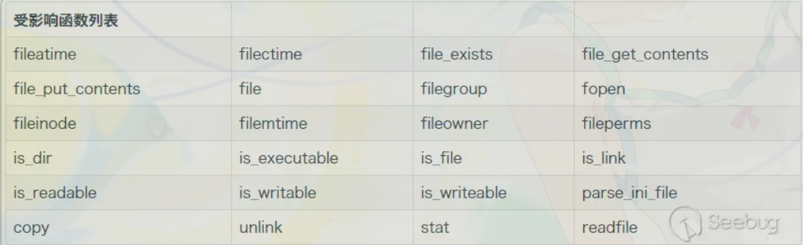

# Rero Meme

## 分析
### login.html
POST username and login

### index.php + lib.php
1. 根據 username 來 new User (每次都要 new 一次，超怪) 
	- User(username, 'images/')
    	- `__contruct()`
    		- dir 預設 '.'
    		- 改變目錄至 dir
    		- **先用 `is_dir()` 判斷路徑是否存在**, 若否, 再根據 username 新增 dir (所以會在 dir/username)
    		- set session['username'] = username
    		- 改變目錄至 DOCUMENT_ROOT
  		- `__toString()`
    		- `htmlentities(username)`
2. 可以 POST file
	- 判斷有沒有 gif signature (GIF89A)
	- POST title 為檔名, re "/[a-z0-9_\- ]+/i"
	- 取得檔案內容, 新增一個 meme
	- Meme(title, author, content)
    	- `__construct()`
        	- `$this->filename = "images/$author/$title.gif";` 這段怪怪
      	- `__destruct()`
           	- content 放到 filename
             	- 任意寫

## 攻擊
其實我覺得根據當周的演講內容, 以及先用 admin login, 看到有人的 payload 像是 phar 壓過的, 就可以猜到這題要想辦法利用 handle file 相關的 function, 因為這些 function 通常含有 php stream wrapper, 而這些 wrapper 最後會 call `unserialize($p->Metadata)`, 造成反序列化攻擊.

達成攻擊的條件有兩個：
1. 寫檔, 並且檔案可存取: 此為網站預設功能, 符合
2. 讀檔, 並且 function 與參數皆有限制: 需要 trace source code, 看看有哪些程式碼片段可以利用

可以先上網搜尋那些常看見的 function 是有用到 php stream wrapper 的：


而仔細觀察發現, 程式碼中有在以上列表的有：
```
if(!is_dir($username)) in lib.php
file_put_contents($this->filename, $this->content); in lib.php
exif_imagetype($tmp_name) in index.php
```

觸發 phar 反序列化的條件為: 傳入參數必須要是 `phar://XXXXX`, 才能有效反序列化 phar file, 因此更進一步的分析：
- `if(!is_dir($username)) in lib.php`
    - username 完全可控, 肯定是我們要的
- `file_put_contents($this->filename, $this->content); in lib.php`
    - 由於 `$filename` 的 define 為 `$this->filename = "images/$author/$title.gif";`, 因此不可能設計成 `phar://` 的樣子
- `exif_imagetype($tmp_name) in index.php`
    - `$tmp_name` 不可控, 也不會是 `phar://XXX` 的樣子

於是找到了讀檔, 透過構造一個 phar file, content 包含：
1. 用來 bypass `IMAGETYPE_GIF` 的 `GIF89A` 起頭
2. 用來讓 php 不要繼續 compile 的 function `<?php __HALT_COMPILER(); >`
3. 注入序列化的 Meme class, 並且能透過 Meme class 的 `__destructor()`: `...; file_put_contents($this->filename, $this->content);` 達到控制任意位置寫檔

產生 payload 的 exploit 為資料夾中的 `exp.php`

以下為攻擊情境：
- payload_name = `qq.gif`
- title = `qqqq`
- 使用者 = u1f383

1. 上傳 payload, 而檔案會存成 `images/u1f383/qqqq.gif`
2. 使用另一個帳號登入, username 為 `phar://u1f383/qqqq.gif`
	- 此時會因為 `is_dir()` 造成 `u1f383/qqqq.gif` 此檔案被反序列化, 產生 `images/qqqqq.php`
3. 存取 `images/qqqqq.php` 即可看到空白頁面, 傳入參數 `a=cat /flag*` 即可拿到 flag