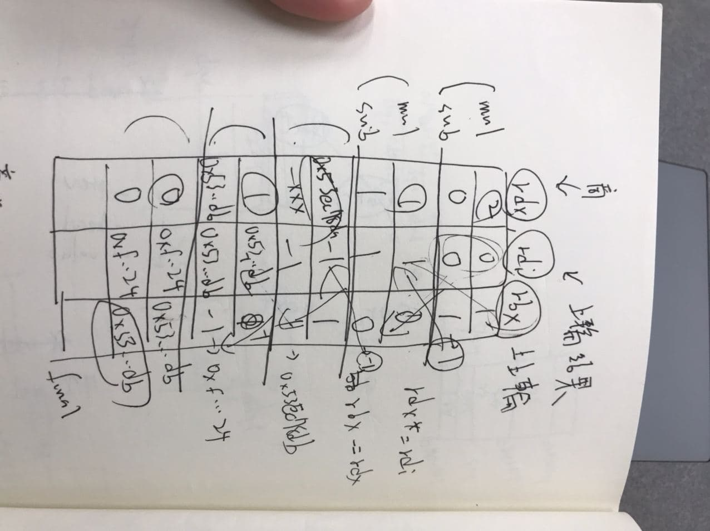

# Hw07
## 分析過程

### 1. 亂 try
首先發現 1,4 需要為 char 'x', 並且 string 透過 ',' 分完要 16 個 part

每個 part 經過 main_bezu 後的值必須是某個質才會通過, 像是 `x1,2,3,4,5,6,7,8,9,0,1,2,3,4,5,6x` => fail

其中幾個重要的 break point, 幫助快速查看 call function 前後的變化
- 0x48e70a (cmp)
- 0x48e595 (call main_rchvf 前)

### 2. 猜測
透過不斷丟數字進去, 發現是與 0xfbc56a93 做輾轉相除法, 並且根據每次的商跟餘做運算, 比對運算結果與 data section 的資料看是否相同, 若相同則繼續比對下一個


以下是計算過程
```
print(gcd(0xfbc56a93, 4224019089))
0xfbc56a93 0xfbc56a91 == 0x1 % 0x2
0xfbc56a91 0x2 == 0x7de2b548 % 0x1
0x2 0x1 == 0x2 % 0x0

print(gcd(0xfbc56a93, 4224019088))
0xfbc56a93 0xfbc56a90 == 0x1 % 0x3
0xfbc56a90 0x3 == 0x53ec78da % 0x2
0x3 0x2 == 0x1 % 0x1
0x2 0x1 == 0x2 % 0x0
0x1 0x0 ret ()

print(gcd(0xfbc56a93, 4224019087))
0xfbc56a93 0xfbc56a8f = 0x1 % 0x4
0xfbc56a8f 0x4 == 0x3ef15aa3 % 0x3
0x4 0x3 == 0x1 % 0x3
0x3 0x1 == 0x3 % 0x0
```

### 3. 明確方向
之後開始做筆記, 紀錄該運算的每次 rdx, rdi, rbx, 找出其規律, 並寫了 exp.py 來找出數字


在比對完第一個後, 發現他會比對到 > 16 的 part, 此時看了迴圈次數為 0x24, 推斷所有的 part 為 0x24 個, 並且每次比對的 part 位置非連續, 是由某位置的值所決定

而分析 binary 從哪裡取值後, 找到對應的位置, 將 "idx 順序" 以及 "期望值" 整個 extract 出來, 並且寫了腳本, 看那些 value 在與 magic number 做 operation 後會是期望值

腳本檔案為 exp.py, 做的 operation 為 `supergcd()`